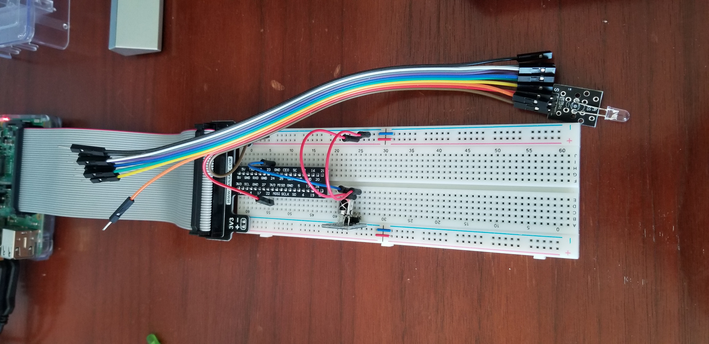
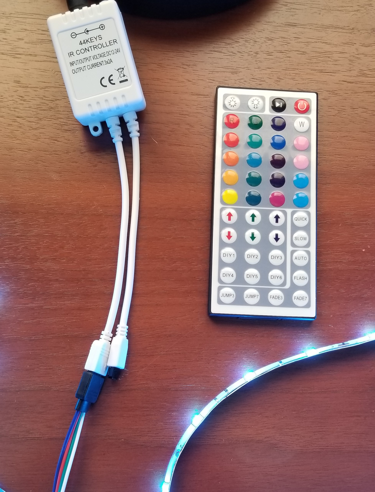
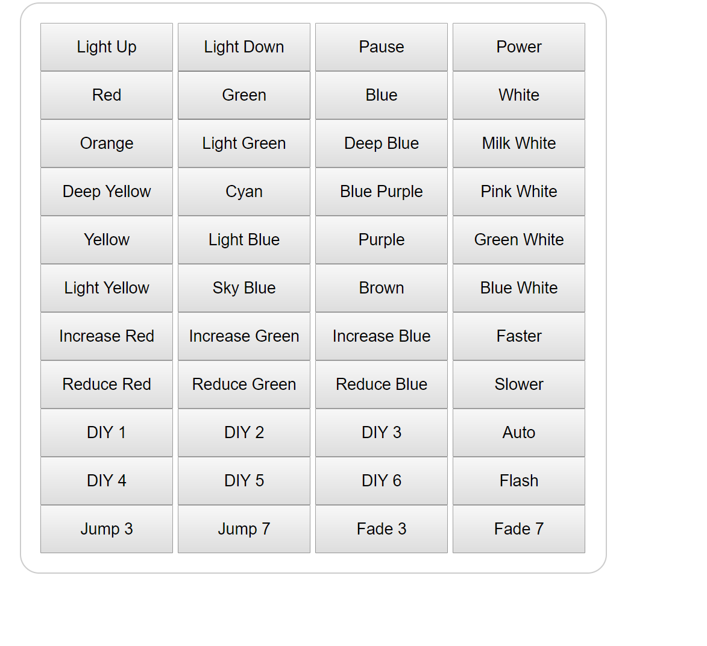

# Led-Control-Web-App
Web application created using the Django web framework to control an LED light strip

Uses LIRC irrecord and an ir reciever to record the ir signals from the led remote and create the remote config file. Then uses LIRC irsend and an ir led to adjust the lights. Commands are sent using a subprocess call.

 

The remote web app runs on a web server created using the Django web framework. The user interface was written in html using the Django template tool.

